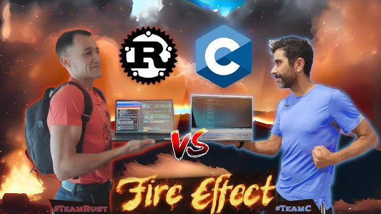

# Rust vs C: Reto de Gráficos por Software

Aprende Rust y C programando gráficos por software con efectos de demoscene clásica de los años 80.

## Episodios

### Episodio 01: Efecto de fuego

**Fecha**: Jueves, 17 de agosto de 2023, 20:00h

Programamos un efecto clásico de fuego en Rust y en C. Para los gráficos utilizamos [Raylib](https://www.raylib.com/).

**[>> Vídeo <<](https://youtube.com/live/RpKQKprrzjo)**

Código fuente:

**[ [Rust] ](chapters/01-fire/rust/)** **[ [Rust-clean] ](chapters/01-fire/rust-clean/)**
